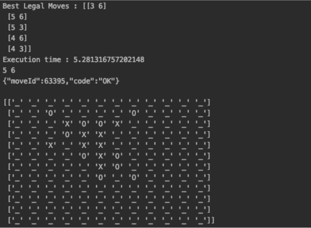

# AI Based Tic Tac Toe

# Agent

**Minimax Algorithm with alpha beta pruning :**

Minimax is a recursive algorithm which is used to choose an optimal move for a player assuming that the opponent is also playing optimally. Alpha beta pruning allows us to search much faster and even go into deeper levels in the game tree. It cuts off branches in the game tree which need not be searched because there already exists a better move available.
Alpha is the best value that the maximizer currently can guarantee at that level or above.Beta is the best value that the minimizer currently can guarantee at that level or above.
To optimize the evaluation further, we have also included depth condition. Which means a node will not be explored after a certain depth.

#Evaluation Function:

We have prioritized nodes to explore in three ways. First, it will check if an opponent has two or more consecutive markers in any rows, columns and diagonals. If there exists such a condition, then we will add those empty positions to legal moves and return. If such a condition doesn’t exist, then we will play aggressively by checking if the same condition exists for our team or not. If it exists then we will add those empty positions to legal moves and return. And if that condition also doesn’t exist then we will check the opponent's markers position and check other, upto eight, positions and then empty positions will be added to legal moves. If the first move is ours we will pass our marker at 6,6 coordinate.

#Runtime:
For the first move we are giving a fixed position on the board and after that we are getting board from the server and passing the board to get the best move from our algorithm. We are finding the legal moves that are the empty position nearby the “X” and “O” marker. Once we get all the legal moves then we use our heuristic function to find best positions and then we are passing those best positions to the minimax algorithm which returns the best score value of the corresponding best position.

